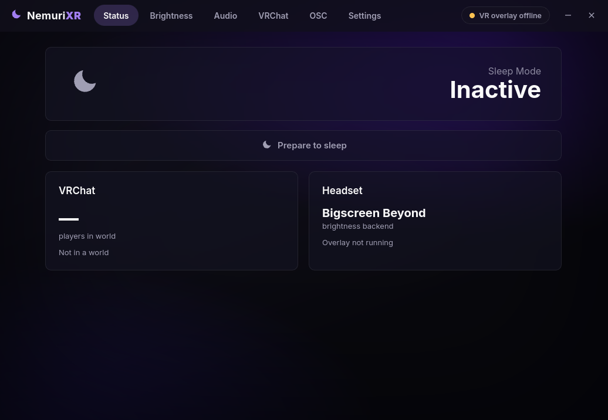

<div align="center">

# 🌙 NemuriXR

**A sleeping utility for VR on Linux**

 dim your headset, quiet your audio, and let VRChat look after itself while you drift off.

Inspired by [OyasumiVR](https://github.com/Raphiiko/Oyasumi). *Nemuri* (眠り) means "sleep".



> **AI usage:** This project was developed with AI assistance (Anthropic's Claude), under human direction, testing, and review.

</div>

## What it does

NemuriXR can notice when you're heading to sleep in VR and handles the things you'd otherwise fumble with half-asleep:

- **🌙 Sleep Mode, in three phases**: *Awake → Prepare → Sleep*. Switch it manually, on a schedule, or automatically once you stop moving. Motion detection can be calibrated in-headset so it knows how *you* sleep.
- **⏰ Wake-up**: wake automatically at a set time with an optional alarm sound, independent of the sleep schedule, so you can use one without the other.
- **🔆 Brightness & fans**: ease the panel brightness and fan speed down as you settle in, with smooth fades. Native control for the **Bigscreen Beyond**; other Monado headsets dim through libmonado.
- **🔊 Audio volume**: lower your output volume and mute your mic per phase. It finds the device VRChat is actually playing through and adjusts that one, falling back to your default device.
- **🎮 VRChat, hands-free**:
  - Join/leave **notification sounds** and a live player count, read straight from the game log.
  - **Auto-accept invite requests** from chosen friends, with player-count limits and an optional custom invite message, plus a custom decline message for the ones it turns down *(signing in unlocks this)*.
  - **Status automations**: flip to *Ask Me* or *Busy* as your world fills up.
  - **In-headset toasts** when an invite is accepted or your status changes, so you know what happened without leaving VR.
- **🖥️ Run commands**: run a shell command or app on each phase: smart lights, a notification, suspend, anything.
- **📡 OSC automations**: send sequences of OSC messages on each phase (avatar toggles, other apps, and so on).

You set everything up in a desktop app, and reach the toggles you actually want in VR from a quick in-headset menu.

## How it works

NemuriXR has two parts that share one configuration:

- **Desktop app**: where you set everything up. It runs the automations in the background and sits in the system tray, so the VRChat and OSC features keep working.
- **In-headset overlay**: a compact quick menu (Sleep Mode, feature toggles, and pose calibration) you open in VR. The desktop app launches it for you when VR starts.

## Requirements

- **Linux** with a **Monado**-based OpenXR runtime (for example, set up with Envision).
- **PipeWire / PulseAudio** (`pactl`) for the audio features.
- A **Bigscreen Beyond** for fan control and native brightness (optional) other headsets still dim via libmonado.
- **VRChat** via Steam/Proton for the VRChat features.

On GNOME the system tray needs the AppIndicator extension; on KDE it works out of the box.

## Install

### From release
- Just head over to the [lates release]() and download the file for your distro.

### Build from source
Build a package and install it:

```bash
cd desktop
pnpm install
pnpm tauri build
```

This produces a `.rpm`, `.deb`, and `.AppImage` in `desktop/src-tauri/target/release/bundle/`, install the one for your distro. On Fedora/Nobara the rpm and AppImage work out of the box; the `.deb` needs `dpkg`. The in-headset overlay is bundled inside the package, so there's nothing else to install.

## Using it

1. Launch NemuriXR and set up your phases, brightness, audio, and VRChat options.
2. *(Optional)* Sign in under **Settings → VRChat Account** to unlock auto-accept and status automations. Your password is never stored, the session token is kept in your system keyring.
3. Put on your headset; the overlay opens automatically. **Double-tap A** on the right controller to open the quick menu (point + trigger to click, grip to move it).
4. *(Optional)* For motion-based sleep, turn it on under **Settings → Sleep Detection**, then calibrate in-headset: open the menu → **Calibrate sleep pose**, lie the way you sleep, and capture.

## Bigscreen Beyond

Brightness and fan control talk to the Beyond over HID, which needs a udev rule (the same one bsb-control uses):

```
KERNEL=="hidraw*", SUBSYSTEM=="hidraw", ATTRS{idVendor}=="35bd", ATTRS{idProduct}=="0101", MODE="0660", GROUP="wheel"
```

Without it, or on any other headset, brightness falls back to libmonado and fan control isn't available.

## Development

```bash
# Desktop app (the engine + UI)
cd desktop && pnpm install && pnpm tauri dev

# Overlay on its own (normally the desktop app launches it for you)
cargo run -p nemurixr-overlay
```

The project is a Rust workspace `crates/core` (shared config, live state, and the IPC protocol) and `crates/overlay` (the OpenXR overlay) alongside `desktop/`, a Tauri v2 + Svelte 5 app that hosts the always-on engine and has a tray. The two halves talk over a Unix socket, with the desktop as the server. Config lives at `~/.config/nemurixr/config.json`.

Overlay environment variables: `NEMURI_OPACITY` (0–1), `NEMURI_NO_ALPHA`, `NEMURI_NO_LASER`.

## License

MIT. Inspired by [OyasumiVR](https://github.com/Raphiiko/Oyasumi).
